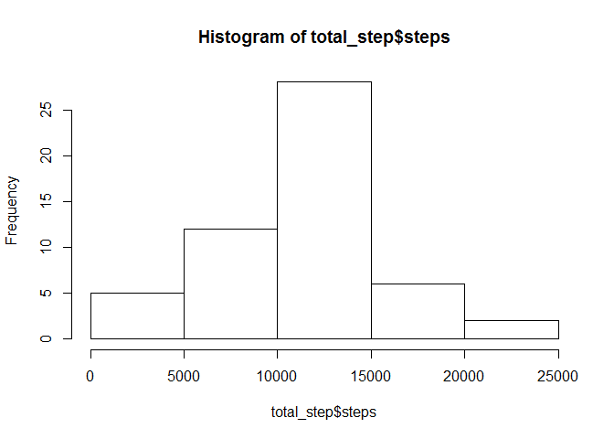
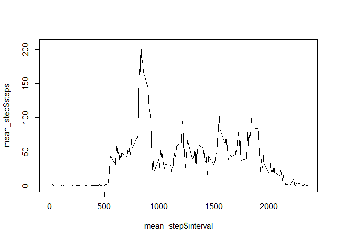
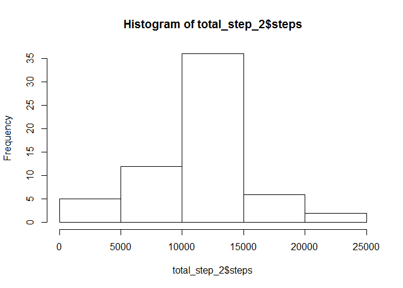
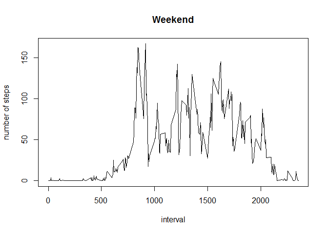
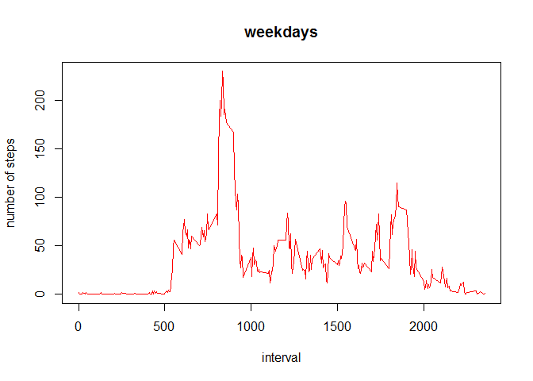

Loading and preprocessing the data
----------------------------------

    temp <- tempfile()
    download.file("https://d396qusza40orc.cloudfront.net/repdata%2Fdata%2Factivity.zip",temp)
    data <- read.csv(unz(temp, "activity.csv"))
    unlink(temp)

    ## What is mean total number of steps taken per day?
    #generate a new data set that includes the total steps by date
    total_step<-aggregate(steps~date,data=data,FUN=sum)

    hist(total_step$steps)

    mean(total_step$steps)

    ## [1] 10766.19

    median(total_step$steps)

    ## [1] 10765

    ## What is the average daily activity pattern?
    # The steps below make a time series plot (i.e. type = "l") of the 5-minute interval (x-axis) and the average number of steps taken, averaged across all days (y-axis)

    mean_step<-aggregate(steps~interval,data=data,FUN=mean)
    head(mean_step)

    ##   interval     steps
    ## 1        0 1.7169811
    ## 2        5 0.3396226
    ## 3       10 0.1320755
    ## 4       15 0.1509434
    ## 5       20 0.0754717
    ## 6       25 2.0943396

    plot(mean_step$interval,mean_step$steps,type="l")

    #The steps below calculates Which 5-minute interval, on average across all the days in the dataset, contains the maximum number of steps?
    mean_step$interval[which(mean_step$steps==max(mean_step$steps))]

    ## [1] 835

    ## Imputing missing values
    #Note that there are a number of days/intervals where there are missing values (coded as NA). The presence of missing days may introduce bias into some calculations or summaries of the data.

    #1. Calculate and report the total number of missing values in the dataset (i.e. the total number of rows with NAs)
    sum(rowSums(is.na(data)))

    ## [1] 2304

    #2. Devise a strategy for filling in all of the missing values in the dataset. The strategy does not need to be sophisticated. For example, you could use the mean/median for that day, or the mean for that 5-minute interval, etc.
    #create a new column by merging raw data set with aggregated data set mean_step

    # the strategy is to replace all the missing value by the mean for that 5 minute interval

    #3. Create a new dataset that is equal to the original dataset but with the missing data filled in.

    colnames(mean_step)<-c("interval","mean_steps")
    data_2<-merge(data,mean_step)
    # replace na value with the mean for the 5-minute intervals
    data_2$steps<-ifelse(is.na(data_2$steps), data_2$mean_steps, data_2$steps)

    #4. Make a histogram of the total number of steps taken each day and Calculate and report the mean and median total number of steps taken per day. Do these values differ from the estimates from the first part of the assignment? What is the impact of imputing missing data on the estimates of the total daily number of steps?

    total_step_2<-aggregate(steps~date,data=data_2,FUN=sum)

    hist(total_step_2$steps)

    mean(total_step_2$steps)

    ## [1] 10766.19

    median(total_step_2$steps)

    ## [1] 10766.19

    # Answer: The mean total number of steps taken per day did not change. However, the median total number of steps taken per day was higher. Inputing missing data won't change the estimation of mean total number of steps taken per day.

    ## Are there differences in activity patterns between weekdays and weekends?

    #For this part the weekdays() function may be of some help here. Use the dataset with the filled-in missing values for this part.

    #1. Create a new factor variable in the dataset with two levels – “weekday” and “weekend” indicating whether a given date is a weekday or weekend day.
    data_2$date<-as.Date(data_2$date)

    data_2$weekday<-ifelse(weekdays(data_2$date) %in% c("星期六","星期日"),"weekend","weekday")

    head(data_2)

    ##   interval    steps       date mean_steps weekday
    ## 1        0 1.716981 2012-10-01   1.716981 weekday
    ## 2        0 0.000000 2012-11-23   1.716981 weekday
    ## 3        0 0.000000 2012-10-28   1.716981 weekend
    ## 4        0 0.000000 2012-11-06   1.716981 weekday
    ## 5        0 0.000000 2012-11-24   1.716981 weekend
    ## 6        0 0.000000 2012-11-15   1.716981 weekday

    #2. Make a panel plot containing a time series plot (i.e. type = "l") of the 5-minute interval (x-axis) and the average number of steps taken, averaged across all weekday days or weekend days (y-axis). See the README file in the GitHub repository to see an example of what this plot should look like using simulated data.

    weekday_mean<-aggregate(steps~interval+weekday, data=data_2, FUN=mean)

    plot1<-plot(weekday_mean$interval[weekday_mean$weekday=="weekend"], weekday_mean$steps[weekday_mean$weekday=="weekend"], type="l", main="Weekend", xlab="interval",ylab="number of steps")

    plot2<-plot(weekday_mean$interval[weekday_mean$weekday=="weekday"], weekday_mean$steps[weekday_mean$weekday=="weekday"], col=2, type="l", main="weekdays", xlab="interval",ylab="number of steps")

knit2html()
